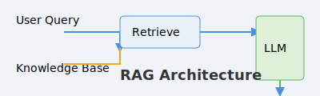
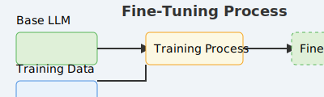

# 本地端 LLM 應用程式範例 (LangChain + Ollama)

這個專案包含了一系列使用 LangChain 和 Ollama 在本地端運行大型語言模型的 Python 範例。
本專案為利用gemini cli進行vibe coding，使用prompt進行程式架構生成、除厝與推送並由作者監控其是否合理

---

## 專案結構

```
.
├── assets
│   ├── finetune_diagram.svg  (微調流程示意圖)
│   └── rag_diagram.svg         (RAG 流程示意圖)
├── finetune
│   ├── dataset.jsonl           (微調用的資料集)
│   ├── finetune.py             (執行微調的腳本)
│   ├── Modelfile               (將微調模型匯入 Ollama 的設定檔)
│   └── test_finetune_example.py(測試微調後模型的腳本)
├── rag
│   ├── my_document.txt         (RAG 所需的外部知識文件)
│   └── rag_example.py          (RAG 應用主腳本)
├── langchain_local_llm_example.py (最基本的本地 LLM 應用腳本)
└── README.md                     (本說明檔案)
```

---

## 環境設定

1.  **安裝 Ollama**
    請至 [https://ollama.com/](https://ollama.com/) 下載並安裝 Ollama。安裝後請確保 Ollama 應用程式正在背景執行。

2.  **下載基礎模型**
    本專案主要使用 `llama3` 模型。請透過 Ollama 應用程式的 GUI 或在終端機執行以下指令來下載模型：
    ```bash
    ollama pull llama3
    ```

3.  **安裝 Python 函式庫**
    本專案需要 LangChain 及其他相關函式庫。請執行以下指令安裝：
    ```bash
    pip install langchain langchain-community faiss-cpu
    ```
    若要執行微調，還需要安裝額外的函式庫：
    ```bash
    pip install torch datasets transformers peft trl bitsandbytes accelerate
    ```

---

## 如何執行範例

**重要：** 所有互動式腳本都需要由您自己在本機的終端機中執行。

### 1. 基本範例 (互動式問答)

這個腳本會直接與 `llama3` 模型進行對話。

```bash
python langchain_local_llm_example.py
```

### 2. RAG 範例 (互動式問答)

這個範例會根據 `rag/my_document.txt` 的內容來回答您的問題。



1.  首先，切換到 RAG 的資料夾：
    ```bash
    cd rag
    ```
2.  執行 RAG 腳本：
    ```bash
    python rag_example.py
    ```

### 3. 微調 (Fine-Tuning) 完整流程

這是一個多步驟的流程，旨在建立一個具有獨特風格的自訂模型。



1.  首先，切換到微調的資料夾：
    ```bash
    cd finetune
    ```
2.  **執行微調腳本**：這個步驟需要有 NVIDIA GPU，且會花費一些時間。
    ```bash
    python finetune.py
    ```
3.  **建立微調模型**：成功執行上一步後，您會得到 `finetuned_adapter` 資料夾。現在使用 `Modelfile` 來建立名為 `pirate-model` 的新模型。
    ```bash
    ollama create pirate-model -f ./Modelfile
    ```
4.  **測試微調後的模型**：執行測試腳本，與您親手微調的模型互動！
    ```bash
    python test_finetune_example.py
    ```
